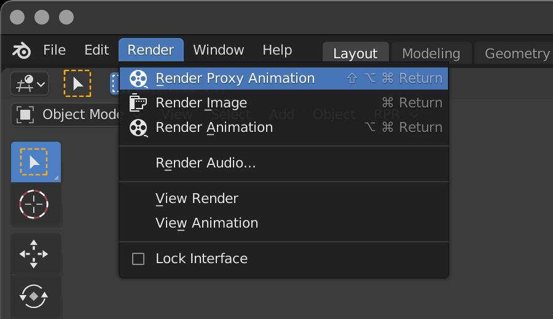
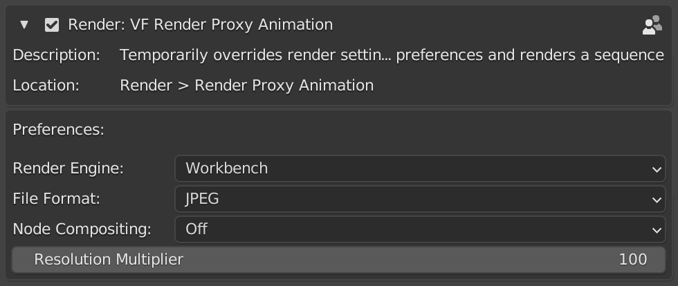

# VF Render Proxy Animation

This add-on was designed for Blender version 2.8-4.1 (though not all previous versions may be fully supported). For Blender 4.2 and onwards, [please see the new Render Kit extension](https://github.com/jeinselen/Blender-RenderKit).

Adds a proxy render menu item to temporarily reduce output quality for super fast animation previews. This Blender add-on helps animators create motion previews without having to manually change the render engine, reduce the output quality, and toggle compositing nodes on and off. Keep rendering full-quality still images and animations while also outputting quick motion previews when needed.

## Installation and usage
- Download [VF_renderProxyAnimation.py](https://raw.githubusercontent.com/jeinselenVF/VF-BlenderRenderProxyAnimation/main/VF_renderProxyAnimation.py)
- Open Blender preferences and navigate to the "Add-ons" tab
- Install and turn on the Add-on
- Customise the preferences as needed
- A new proxy render option will show up in the drop down Render menu

## Add-on Preferences

Proxy settings are found under the plugin listing in the Add-on panel of the Blender preferences.

- `Render Engine` choose either Workbench (shaded preview) or Eevee (will use whatever sampling settings are enabled in the Render Properties tab)
- `File Format` use project settings or override with JPEG, PNG, or OpenEXR formats (any of these overrides will use the existing settings accessible in the Output Properties tab)
- `Node Compositing` can use the current project settings (as set in the Compositing window), force on, or force off (helpful if the compositing nodes are slow to compute and unneeded for animation previews)
- `Resolution Multiplier` overrides the setting found in the Output Properties tab so that half or quarter resolution proxy files can be created

All of these render and output settings are temporarily enabled during the proxy rendering, and the project settings are restored when completed.

## Notes

- Because the basic Python setup used here is synchronos, the user interface will freeze during the rendering process.
- Third party render engines like LuxCore and Radeon ProRender are not included as options for proxy rendering, but this plugin was designed for situations where third-party engines may benefit from a temporary preview engine like Workbench when creating animation proxies for editing.